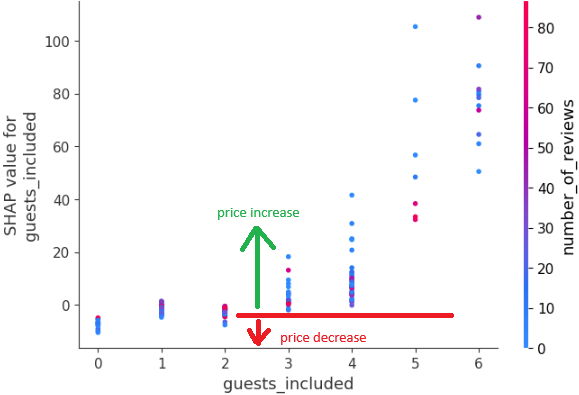
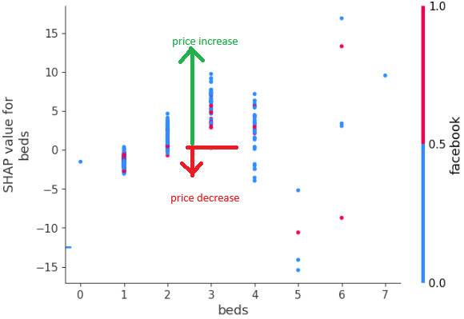

# AirBnB-Data-Insights : Alex's story

#### Welcome to the Udacity Data Scientist Nanodegree capstone project 1 - a data science blogpost. 
This excercise is meant as a practice of making data driven decisions. 
The dataset we're about to analyze is available at    https://www.kaggle.com/datasets/airbnb/boston/data  
You can read it also at https://www.kaggle.com/code/tomcajan/alex-s-story-a-udacity-project 
You can find project code in notebook AirBnB_Blogpost.ipynb, along with image folder used to enhance this readme file. 
This is a Python project using libraries Numpy and Pandas for data handling, XGBoost for modeling and Plotly with SHAP for visualization. 

Since this dataset was used quite many times, a creative approach was selected to find some non-trivial questions about this dataset and answer them using data.  

-------------

**Scenario :**  
Meet Alex, a young Data Scientist, living in Boston, in the Roxbury neighbourhood. Alex is a happy owner of a nice apartment. 
Alex is currently planning his vacation. He would like to travel arround the world for full 2 months. 
That is quite expensive fun however, even for Alex, so he is trying to figure out, how to reduce the costs of his vacation. He does not really care when he goes for the vacation, for as long as it lasts 2 months. 
Alex gets an idea - how about he rents his apartment while he is away, using the AirBnB. The rent could pay good portion of his travel expenses. 

You can read about his adventures with AirBnB below.

You already heard that Alex would like to rent his apartment using AirBnB. 
However Alex knows nothing about AirBnB and renting at all. 
Good thing he's a Data Scientist! He can make the data talk and help him. Alex has 3 questions about the rent that make him curious the most. 
Answering them should help in decision making about how and when to rent.
With the Kaggle Boston AirBnB dataset in his hands, Alex is ready to crack the mystery of a successful renting with AirBnB. 

#### 3 main questions Alex has before he is ready to rent his apartment : 

**Question 1** : When is the optimal time to rent his apartment, for him to make the most money from the rent?

**Question 2** : How are his chances to rent his apartment for full two months compared to apartments in other city neighbourhoods?

**Question 3** : What are the main factors influencing customers, who would rent such apartment? What can he do to improve his chances to attract people or earn more from rent?

-------------

**Question 1** : When is the optimal time to rent his apartment, for him to make the most money from the rent? 

To answer this question, Alex has to use his coding and statistics skills to filter data specificaly according to his needs.

- He has two dataframes, one containing rent prices and the other rent time periods, he needs to join them together first.
- The only time data he has available are timestamps of rents, therefore he has to divide his data into months.
- He has to filter the dataframe by location, to include only his neighborhood - Roxbury.
- And finaly he has to visualize the pair of months, where the expected rent price is the highest.

- And there's the answer! It looks like Alex can make the most money from rent in period June-July.

-------------

**Question 2** : How are his chances to rent his apartment for full two months compared to apartments in other city neighbourhoods?

To answer this, Alex has to use his filtering and visualization skills again, this time in a different setting.

- He performs the steps he did to answer the previous question
- Then additionaly he has to filter the data only for those rent records, that lasted at least 60 days to be relevant.
- And also limit the filtering only for those staring in June, because that is when we wants to start the rent.
- Finaly he has to compare the ammount of rent listings for all neighborhoods with the filtered dataset and visualize the result.

And there is the answer Alex is looking for  - we can observe that the ammounts of rents per neighbourhood are roughly separated into 3 categories - high, medium and low. 
Alex ranked in the medium category - not bad, not great. 
Alex definintely has good chances to rent his apartment, however he should use all the advantages he could get to satisfy his customers needs to attract them. 
His next question will help him with that! 

-------------

**Question 3** : What are the main factors influencing customers, who would rent such apartment? What can he do to improve his chances to attract people or earn more from rent?

It's finaly time for Alex to showcase his machine learning skills, because to answer this question, he will need a trained machine learning model.
Machine learning model can show its feature importances, in other words identify categories it considers important when predicting.
This can lead Alex to points, that can help him understand the customers behaviour and preferences.

Alex is a fan of XGBoost machine learning model, so he utilizes it to train it on his data and assess its feature importances.

There are many categories the model is trained on. While the model considers them important, by far not all of them will be relevant to Alex. 
Because it is his first rent listing, all the reviews based categories won't help him in any way. 
The categories that describe type of the house and location are also not very helpful, since Alex isn't going to move just because renting his apartment better. 
But still, he can find some hints about what to work on. 

SHAP values are a great tool for understanding how the model decides. In this case, how to understand how value of categories manipulates the price.
Alex can use it to learn:  

- How can allowing guests into the rented apartment influence the price people are willing to pay for the rent.
  

The figure shows that allowing at least 3 guests into the apartment can increase the price people are willing to pay for the rent. Simple thing to do.

- How does bed count in the apartment matter?

Having only one bed, which is Alex's case, is not a desired option for many. Good thing there's a furniture store in the next street, so Alex can buy a new one.

- What kinds of verifications do people appreciate the most?  
There are several options he can use, like Facebook, LinkedIn, Jumio, or kba.

In the SHAP values Alex can notice, that beigh verified over Facebook and Jumio directy lowers the expected price people will be willing to pay. For kba the result is mixed. 
Only for the LinkedIn, having that verification seems to correlate with price increase. 
It is no surprise afterall, since linkedIn requires people's personal ID's to be scanned to get verified. 

-------------

So it's now all clear for Alex. Let's sum up what he learned. 

1) He should allow at least 3 guest for the time of rent. 
2) He should buy a new bed, so that he has at least two of them. 
3) For the verification, he should choose LinkedIn as it appears to be the one most trusted according to his data. 

And that's it! All this knowledge should be just about enough for Alex to sucessfully rent his apartment. 
So let's hope he will be a good landlord and lets wish him a happy vacation. 

